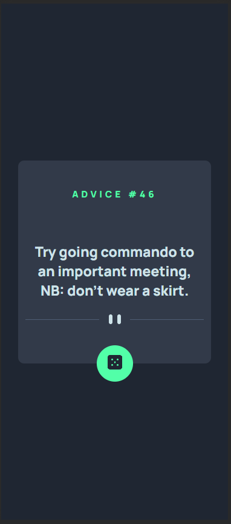

# Advice generator app
## (Last Update) - 31/12/2023
### This project is a milestone of a FullStack developer course, serving to reinforce foundational principles and then upload it to a GitHub repository.

  <a href="#-technologies">Technologies</a>&nbsp;&nbsp;&nbsp;|&nbsp;&nbsp;&nbsp;
  <a href="#-project">Project</a>&nbsp;&nbsp;&nbsp;|&nbsp;&nbsp;&nbsp;
  <a href="#-layout">Layout</a>

## 🚀 Technologies

This project has been developed employing the following technologies:

- HTML and CSS
- JS
- API

## 💻 Project

The Project forms a component of a series of challenges and milestones aimed at improvement throughout the course. Post-class, the students endeavour to independently replicate a particular task. In this instance, one challenge was divided into the website (HTML + CSS) and the random advices (JS) using an API, this is the first part uploaded to GitHub.

## 🔖 Layout

    
Desktop:

    

    
Mobile and Loading:

    
    

The App is currently accessible at: https://bigodrigo.github.io/adviceApp/

## :muscle: Suggested Enhancements:

- [x] Add a skeleton Animation;
- [ ] Animate the dice with a roll;